PAV - P5: síntesis musical polifónica
=====================================

Obtenga su copia del repositorio de la práctica accediendo a [Práctica 5](https://github.com/albino-pav/P5) 
y pulsando sobre el botón `Fork` situado en la esquina superior derecha. A continuación, siga las
instrucciones de la [Práctica 2](https://github.com/albino-pav/P2) para crear una rama con el apellido de
los integrantes del grupo de prácticas, dar de alta al resto de integrantes como colaboradores del proyecto
y crear la copias locales del repositorio.

Como entrega deberá realizar un *pull request* con el contenido de su copia del repositorio. Recuerde que
los ficheros entregados deberán estar en condiciones de ser ejecutados con sólo ejecutar:

~~~~~~~~~~~~~~~~~~~~~~~~~~~~~~~~~~~~~~~~~~~~~~~~~~~~~.sh
  make release
~~~~~~~~~~~~~~~~~~~~~~~~~~~~~~~~~~~~~~~~~~~~~~~~~~~~~

A modo de memoria de la práctica, complete, en este mismo documento y usando el formato *markdown*, los
ejercicios indicados.

Ejercicios.
-----------

### Envolvente ADSR.

Tomando como modelo un instrumento sencillo (puede usar el InstrumentDumb), genere cuatro instrumentos que
permitan visualizar el funcionamiento de la curva ADSR.

* Un instrumento con una envolvente ADSR genérica, para el que se aprecie con claridad cada uno de sus
  parámetros: ataque (A), caída (D), mantenimiento (S) y liberación (R).
* Un instrumento *percusivo*, como una guitarra o un piano, en el que el sonido tenga un ataque rápido, no
  haya mantenimiemto y el sonido se apague lentamente.
  - Para un instrumento de este tipo, tenemos dos situaciones posibles:
    * El intérprete mantiene la nota *pulsada* hasta su completa extinción.
    * El intérprete da por finalizada la nota antes de su completa extinción, iniciándose una disminución
	  abrupta del sonido hasta su finalización.
  - Debera representar en esta memoria **ambos** posibles finales de la nota.
* Un instrumento *plano*, como los de cuerdas frotadas (violines y semejantes) o algunos de viento. En
  ellos, el ataque es relativamente rápido hasta alcanzar el nivel de mantenimiento (sin sobrecarga), y la
  liberación también es bastante rápida.

Para los cuatro casos, deberá incluir una gráfica en la que se visualice claramente la curva ADSR. Deberá
añadir la información necesaria para su correcta interpretación, aunque esa información puede reducirse a
colocar etiquetas y títulos adecuados en la propia gráfica (se valorará positivamente esta alternativa).

### Envolvente ADSR (instrumento genérico)

En `InstrumentDumb` y `Seno` usamos la misma envolvente ADSR para dar forma a cada nota: primero sube (Attack), luego baja un poco (Decay), se mantiene mientras dura la nota (Sustain) y al soltarla se va apagando (Release). En la figura se ve cómo esos tramos cambian la amplitud de la señal a lo largo del tiempo.

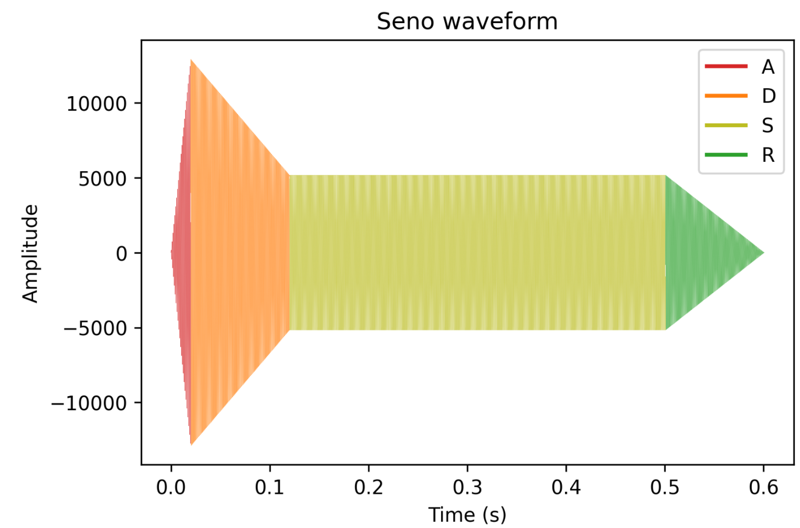

Figura: seno con envolvente ADSR.

### Instrumento percusivo

El instrumento con estas características lo hemos implementado como `Percussion`. Luego lo hemos adaptado para que el sonido tenga el pitch de la nota que se toque (`PercussionPitch`) o, si se usan samples, para que se reproduzca el audio completo sin cambiar el pitch (`PercussionSample`).

Su envolvente cuando el sonido termina sin ser interrumpido es la siguiente:

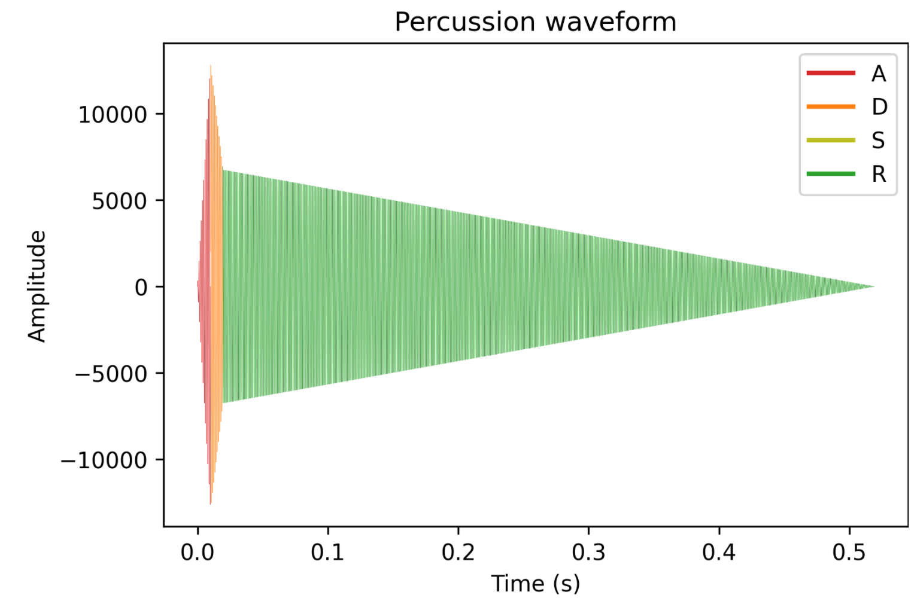

Figura: envolvente percusiva sin interrupción.

Si se interrumpe la nota (la tecla deja de estar pulsada), hacemos que el sonido caiga de forma exponencial a partir de ese instante. Ajustando la constante se consigue una caída más suave o más brusca.

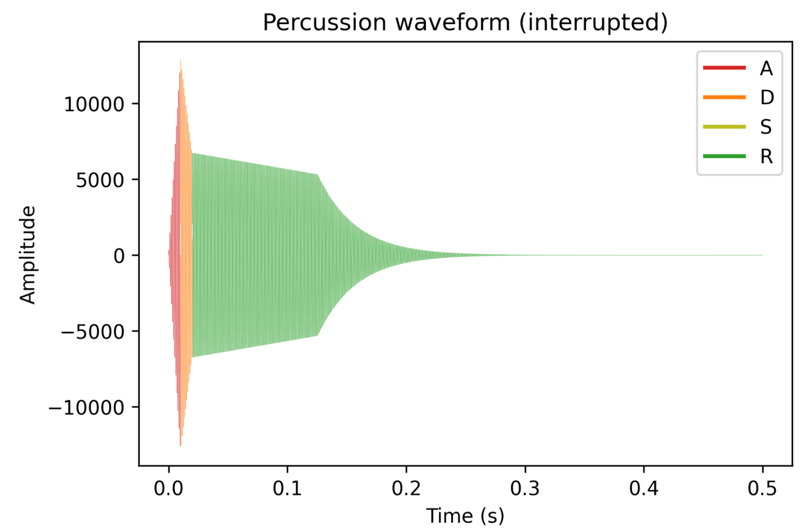

Figura: caída al soltar la nota (interrupción).

### Instrumento plano

Para el instrumento plano hemos creado la clase `Strings`. La idea es tener una nota más estable: un ataque suave, un sustain largo y un release que se apaga de forma progresiva.

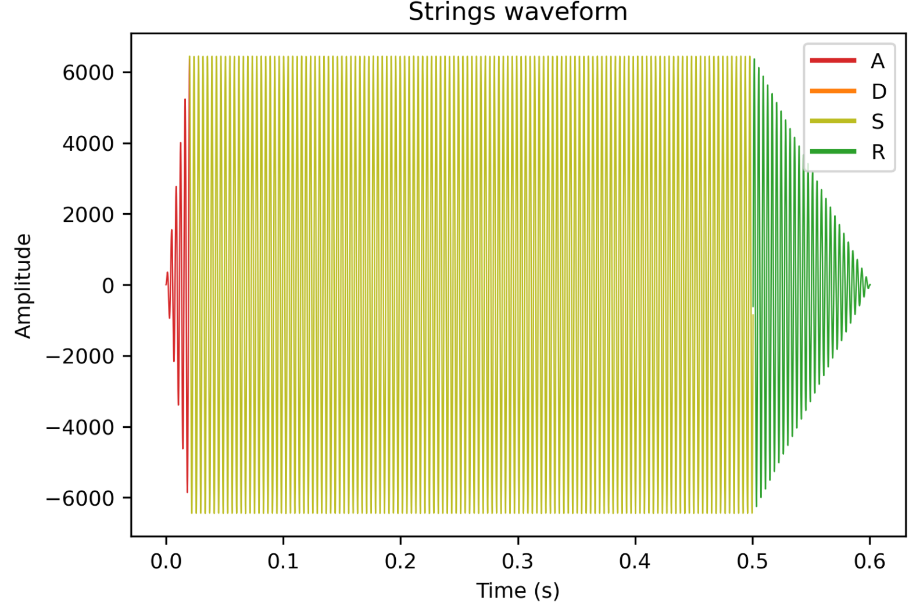

Figura: envolvente tipo “plana” para `Strings`.

Esta clase, igual que `PercussionPitch`, también se ha adaptado para poder tocar las notas correspondientes (cambiando el pitch según la nota).

### Instrumentos Dumb y Seno.

Implemente el instrumento `Seno` tomando como modelo el `InstrumentDumb`. La señal **deberá** formarse
mediante búsqueda de los valores en una tabla.

- Incluya, a continuación, el código del fichero `seno.cpp` con los métodos de la clase Seno.
```cpp
#include <iostream>
#include <math.h>
#include "seno.h"
#include "keyvalue.h"
#include "wavfile_mono.h"

#include <stdlib.h>

using namespace upc;
using namespace std;

Seno::Seno(const std::string &param)
    : adsr(SamplingRate, param)
{
  bActive = false;
  x.resize(BSIZE);

  KeyValue kv(param);
  if (!kv.to_int("N", N))
    N = 40; //default value

  if (!kv.to_float("volume", volume))
    volume = 1; //default value

  index = 0;

  std::string file_name;
  static string kv_null;
  int error = 0;
  if ((file_name = kv("file")) == kv_null)
  {
    cerr << "Error: no se ha encontrado el campo con el fichero de la señal para un instrumento FicTabla.\nUsando sinusoide por defecto..." << endl;
    //Create a tbl with one period of a sinusoidal wave
    tbl.resize(N);
    float phase = 0, step = 2 * M_PI / (float)N;
    index = 0;
    for (int i = 0; i < N; ++i)
    {
      tbl[i] = sin(phase);
      phase += step;
    }
  }
  else
  {
    unsigned int fm;
    error = readwav_mono(file_name, fm, tbl);
    if (error < 0)
    {
      cerr << "Error: no se puede leer el fichero " << file_name << " para un instrumento FicTabla" << endl;

      throw -1;
    }
    N = tbl.size();
  }
}

void Seno::command(long cmd, long note, long vel)
{
  if (cmd == 9)
  { //'Key' pressed: attack begins
    bActive = true;
    adsr.start();
    index = 0;
    float f0note = pow(2, ((float)note - 69) / 12) * 440; //convert note in semitones to frequency (Hz)
    float Nnote = 1 / f0note * SamplingRate;              //obtain note period in samples
    index_step = (float)N / Nnote;                        //obtain step (relationship between table period and note period)
    if (vel > 127)
      vel = 127;

    A = vel / 127.;
  }
  else if (cmd == 8)
  { //'Key' released: sustain ends, release begins
    adsr.stop();
  }
  else if (cmd == 0)
  { //Sound extinguished without waiting for release to end
    adsr.end();
  }
}

const vector<float> &Seno::synthesize()
{
  if (not adsr.active())
  {
    x.assign(x.size(), 0);
    bActive = false;
    return x;
  }
  else if (not bActive)
    return x;

  unsigned int index_floor, next_index; //interpolation indexes
  float weight;                         //interpolation weights

  for (unsigned int i = 0; i < x.size(); ++i)
  {
    //check if the floating point index is out of bounds
    if (floor(index) > tbl.size() - 1)
      index = index - floor(index);

    //Obtain the index as an integer
    index_floor = floor(index);
    weight = index - index_floor;

    //fix interpolation indexes if needed
    if (index_floor == (unsigned int)N - 1)
    {
      next_index = 0;
      index_floor = N - 1;
    }
    else
    {
      next_index = index_floor + 1;
    }
    //interpolate table values
    x[i] = A * volume * ((1 - weight) * tbl[index_floor] + (weight)*tbl[next_index]);

    //update real index
    index = index + index_step;
  }
  adsr(x); //apply envelope to x and update internal status of ADSR

  return x;
}
```

Para generar la señal a partir de la tabla, recorremos sus valores con un índice que avanza según la frecuencia. Como ese índice suele caer entre dos posiciones, aplicamos interpolación lineal para estimar el valor intermedio y evitar “escalones” en la forma de onda.

Al llegar al final de la tabla probamos dos formas de gestionar el índice. Si lo forzamos a 0, aparece una pequeña discontinuidad porque el valor 0 no coincide con la fase real de la sinusoide (se nota como un salto). La opción que mejor resultado nos da es “envolver” el índice y volver al valor equivalente dentro de la tabla (índice actual − N), manteniendo la continuidad de fase.

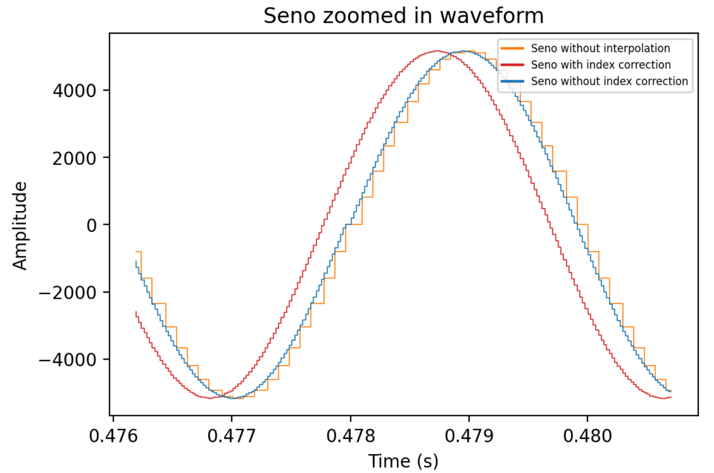

Figura: comparación del seno con y sin interpolación y con distintas formas de resetear el índice.

Las grabaciones de estos tres casos se han guardado en `work/ejemplos/`:
`seno_with_index_correction.wav`, `seno_without_index_correction.wav` y `seno_without_interp.wav`.

  
- Explique qué método se ha seguido para asignar un valor a la señal a partir de los contenidos en la tabla,
  e incluya una gráfica en la que se vean claramente (use pelotitas en lugar de líneas) los valores de la
  tabla y los de la señal generada.
  
  Para obtener el valor de la señal entre dos posiciones de la tabla usamos interpolación lineal. Tomamos el índice real (decimal), calculamos el índice inferior `index_floor` y el siguiente `next_index = index_floor + 1`. Con un peso `weight` (la parte decimal) mezclamos ambos valores para aproximar el punto intermedio y suavizar la forma de onda.

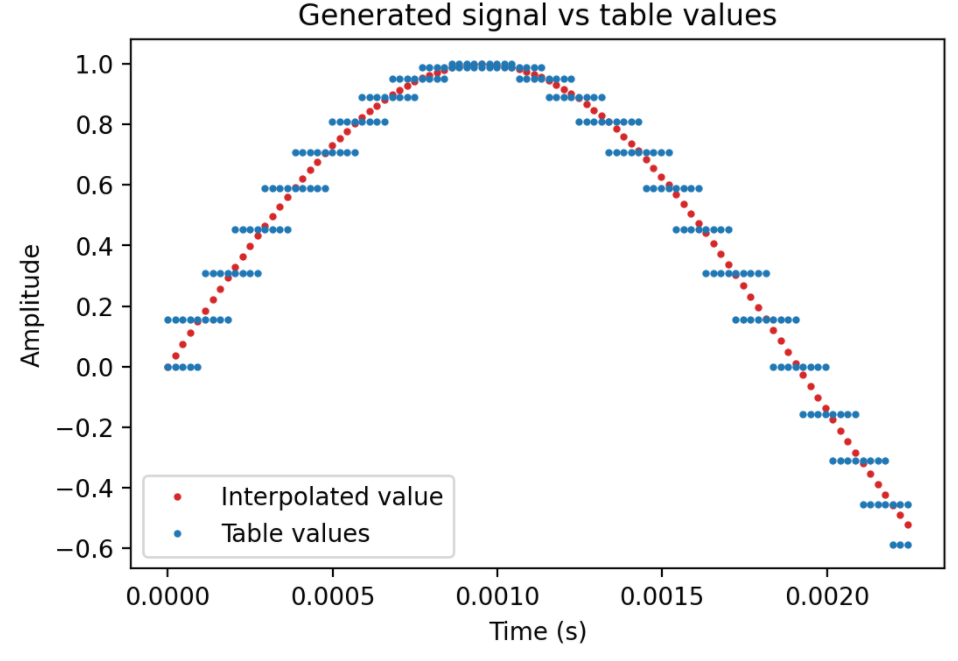

Figura: valores discretos de la tabla (puntos) y valor interpolado de la señal.


- Si ha implementado la síntesis por tabla almacenada en fichero externo, incluya a continuación el código
  del método `command()`.

Si la tabla se lee desde un fichero externo, el método `command()` que gestiona la carga/selección de la tabla es el siguiente:

```cpp
void PercussionSample::command(long cmd, long note, long vel)
{
  if (cmd == 9)
  { //'Key' pressed: attack begins
   bActive = true;
   index = 0;
    total_samples_played = 0;
   gotInterrupted = false; //reset status for every new note. By default, it can't get interrupted (interrupt==0)
    interrupted_count = 0;  
   if (vel > 127)
     vel = 127;
    A = vel / 127.;
  }
}
```

### Efectos sonoros.

- Incluya dos gráficas en las que se vean, claramente, el efecto del trémolo y el vibrato sobre una señal
  sinusoidal. Deberá explicar detalladamente cómo se manifiestan los parámetros del efecto (frecuencia e
  índice de modulación) en la señal generada (se valorará que la explicación esté contenida en las propias
  gráficas, sin necesidad de *literatura*).

  Para esta parte, hemos generado señales usando `doremi.sco` (quedándonos con la primera nota) y ajustando `Seno` para que el tramo de sustain sea el predominante y así se vea el efecto sin que la envolvente ADSR “moleste”.

#### Trémolo

El trémolo consiste en escalar la señal con una sinusoide de frecuencia `fm` y amplitud `A`. En la práctica se ve como una variación periódica del volumen: la sinusoide principal mantiene su tono, pero su amplitud sube y baja siguiendo una envolvente.

En una señal simple (sinusoide), `fm` se puede estimar midiendo el periodo de la envolvente (tiempo entre máximos). El parámetro `A` se refleja en la profundidad del trémolo: cuanto mayor es, mayor diferencia hay entre los máximos y mínimos de la envolvente.

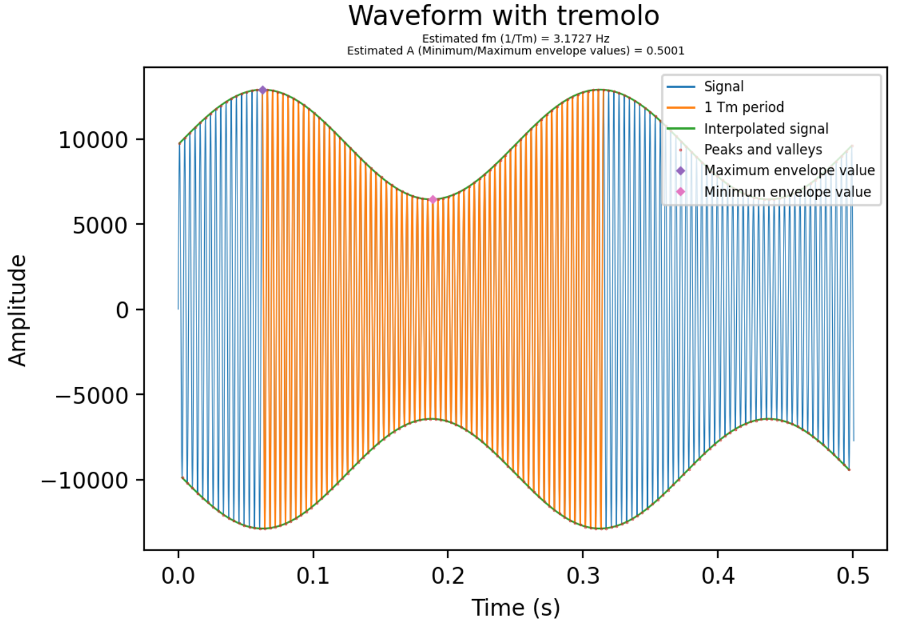

Figura: trémolo sobre una sinusoide. `fm` marca la velocidad de la envolvente y `A` la profundidad.

Parámetros usados: Tremolo `A=0.5`, `fm=4`.

El código para generar esta gráfica y estimar los parámetros está en `scripts/tremolo_graph.py`.

#### Vibrato

En el vibrato la amplitud se mantiene prácticamente constante, pero cambia la frecuencia instantánea. Para que se vea claro en las gráficas hemos usado una nota de 90 semitonos (`fc = 466.16 Hz`) y una frecuencia de modulación alta.

Con valores bajos del índice `I` (vibrato suave) la FFT muestra un pico principal en `fc` y aparecen componentes pequeñas separadas por `fm` alrededor de la central. Es decir, `fm` decide la separación entre picos (dónde aparecen) y `I` controla cuánto “peso” ganan esas componentes.

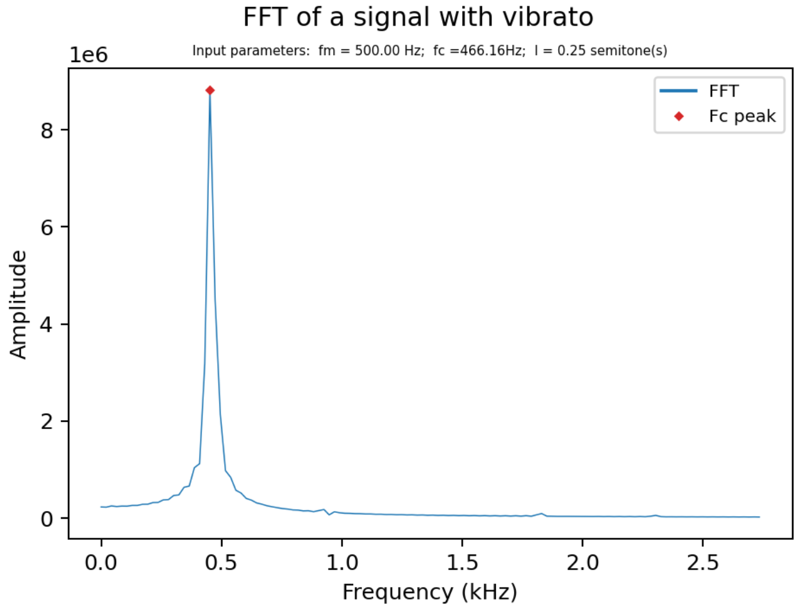

Figura: FFT con vibrato suave (pico principal en `fc` y primeras componentes alrededor).

Al aumentar `I`, aparecen más picos (múltiplos de `fm` respecto a `fc`) y ganan amplitud. En los siguientes ejemplos se ve cómo la energía se reparte más en esas componentes y el pico de la fundamental pierde protagonismo.

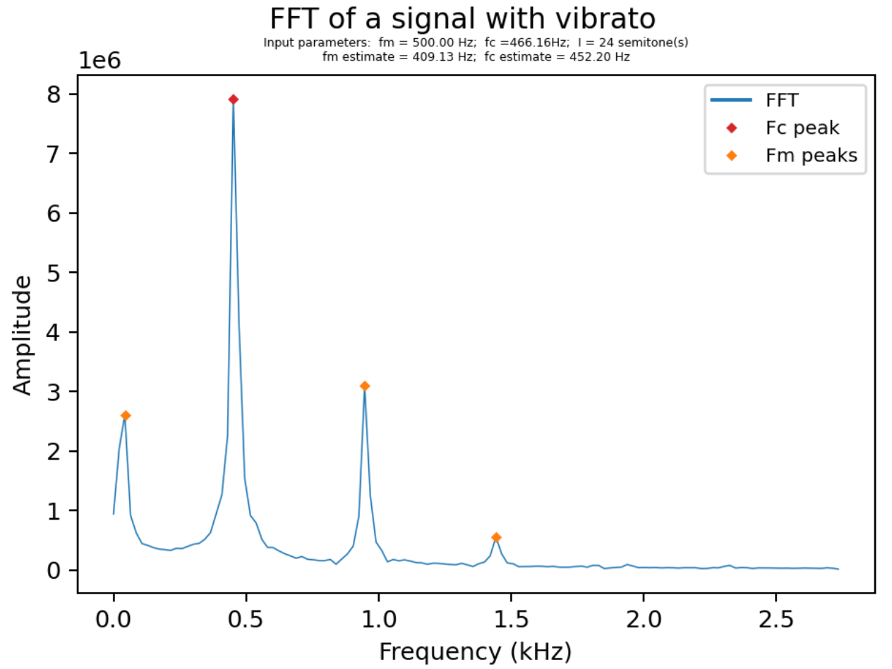

Figura: FFT con picos marcados. La separación es `fm` y la amplitud depende de `I`.

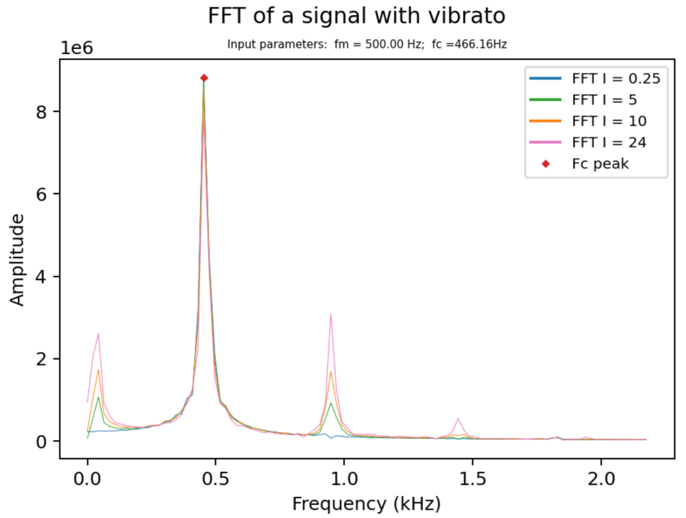

Figura: comparación en frecuencia para distintos valores de `I`.

Si hacemos zoom alrededor de la fundamental, se aprecia mejor cómo disminuye su amplitud cuando `I` aumenta (la energía se reparte en las bandas laterales).

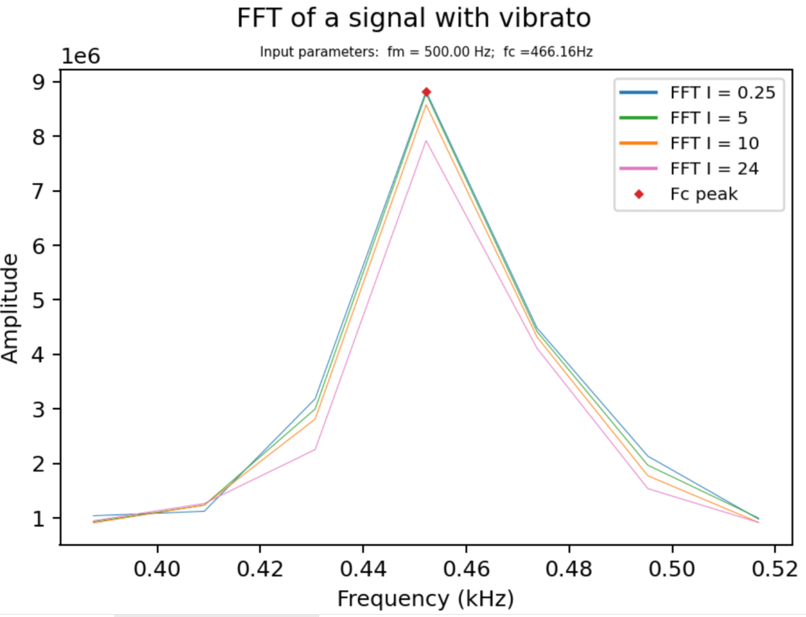

Figura: zoom en `fc` para ver la pérdida de peso de la fundamental al subir `I`.

En el dominio temporal, el efecto de aumentar `I` se nota en que los ciclos dejan de estar “igual de separados”: la onda se comprime y se estira más, haciendo el vibrato más perceptible.

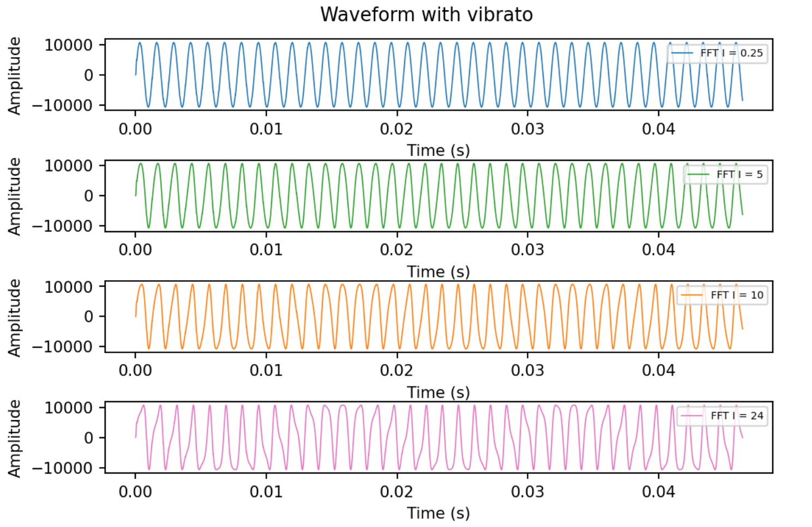

Figura: vibrato en el tiempo para distintos valores de `I`.

El código para obtener las gráficas en tiempo y frecuencia está en `scripts/time_vibrato_graph.py` y `scripts/freq_vibrato_graph.py`, respectivamente.

- Si ha generado algún efecto por su cuenta, explique en qué consiste, cómo lo ha implementado y qué
  resultado ha producido. Incluya, en el directorio `work/ejemplos`, los ficheros necesarios para apreciar
  el efecto, e indique, a continuación, la orden necesaria para generar los ficheros de audio usando el
  programa `synth`.

El efecto que hemos implementado ha sido la distorsión. Consiste en saturar la salida por encima de un umbral (clipping), lo que genera una distorsión audible.

Para implementarlo, como nuestras señales tienen amplitud variable (envolvente ADSR), hemos aplicado el clipping de forma local usando una ventana deslizante. En cada ventana calculamos el mínimo y el máximo y recortamos la señal respecto a un umbral definido como porcentaje de esa amplitud. Así el efecto se adapta mejor a los cambios de volumen de la propia señal.

Los parámetros de entrada se leen desde el fichero `effects`: `t` (porcentaje de amplitud a partir del cual se recorta) y `tm` (duración de la ventana en segundos). Con frecuencias altas se obtienen resultados más estables porque es más fácil asegurar que el máximo de la sinusoide cae dentro de la ventana. Además, con valores de `tm` pequeños se consigue un clipping más suave, que se percibe más como una reducción de volumen que como un recorte agresivo.

Código del efecto:

 ```cpp
	  void Distortion::operator()(std::vector<float> &x)
  	{
    float max, min;
    int window_count = 0;

    for (unsigned int i = 0; i < x.size(); i++)
    {

  	//update maximum and minimum clipping value
  	if (window_count == 0)
  	{
  	  max = 0;
  	  min = 0;

  	  for (unsigned int j = i; j < i + tm; j++)
  	  {
  		//quit search if the end of x has been reached
  		if (j > x.size())
  		{
  		  break;
  		}

  		if (max < x[j])
  		{
  		  max = x[j];
  		}
  		if (min > x[j])
  		{
  		  min = x[j];
  		}
  	  }
  	}
  	//clip the signal if needed
  	if (((max * t) < x[i]))
  	{
  	  x[i] = max * t;
  	}
  	if (((min * t) > x[i]))
  	{
  	  x[i] = min * t;
  	}

  	window_count++;
  	if (window_count > tm)
  	{
  	  window_count = 0;
  	}
    }
 ```

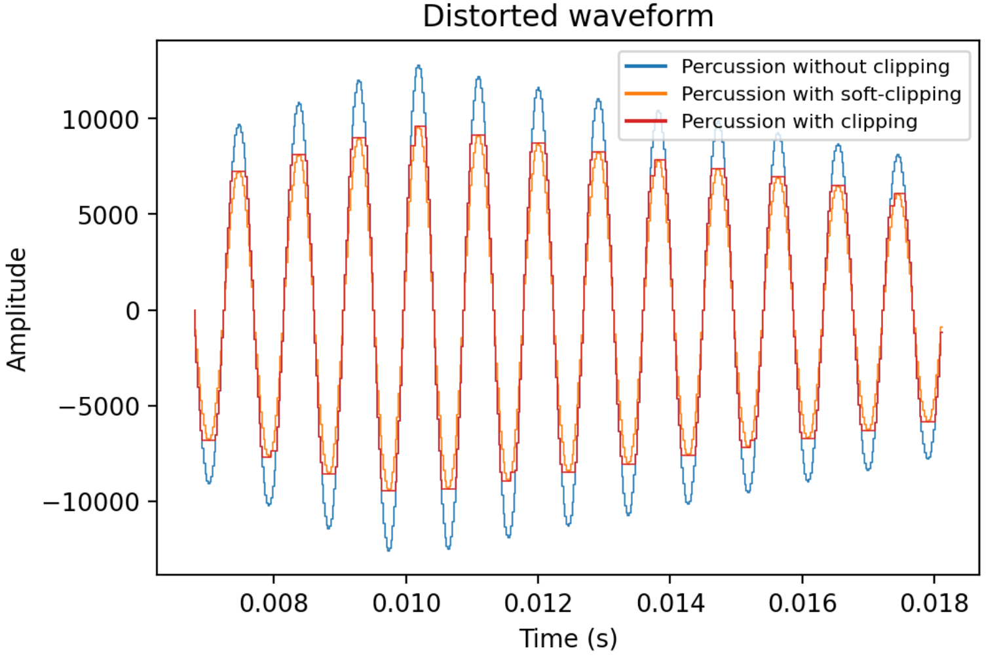

Figura: comparación de la señal original con clipping y soft-clipping; con tm pequeño el recorte es más suave y se nota menos agresivo.

La orden para aplicar el efecto ha sido:

    synth -e work/effects.orc work/percussion.orc work/doremi.sco distortion.wav

Los parámetros del efecto en este ejemplo han sido un umbral `t=0.75` y una ventana `tm=0.01 s` para el clipping estándar y `tm=0.000001 s` para el soft-clipping. Las tres señales generadas se encuentran en `work/ejemplos/`.


### Síntesis FM.

Construya un instrumento de síntesis FM, según las explicaciones contenidas en el enunciado y el artículo
de [John M. Chowning](https://web.eecs.umich.edu/~fessler/course/100/misc/chowning-73-tso.pdf). El
instrumento usará como parámetros **básicos** los números `N1` y `N2`, y el índice de modulación `I`, que
deberá venir expresado en semitonos.

- Use el instrumento para generar un vibrato de *parámetros razonables* e incluya una gráfica en la que se
  vea, claramente, la correspondencia entre los valores `N1`, `N2` e `I` con la señal obtenida.
- Use el instrumento para generar un sonido tipo clarinete y otro tipo campana. Tome los parámetros del
  sonido (N1, N2 e I) y de la envolvente ADSR del citado artículo. Con estos sonidos, genere sendas escalas
  diatónicas (fichero `doremi.sco`) y ponga el resultado en los ficheros `work/doremi/clarinete.wav` y
  `work/doremi/campana.work`.
  * También puede colgar en el directorio work/doremi otras escalas usando sonidos *interesantes*. Por
    ejemplo, violines, pianos, percusiones, espadas láser de la
	[Guerra de las Galaxias](https://www.starwars.com/), etc.

### Orquestación usando el programa synth.

Use el programa `synth` para generar canciones a partir de su partitura MIDI. Como mínimo, deberá incluir la
*orquestación* de la canción *You've got a friend in me* (fichero `ToyStory_A_Friend_in_me.sco`) del genial
[Randy Newman](https://open.spotify.com/artist/3HQyFCFFfJO3KKBlUfZsyW/about).

- En este triste arreglo, la pista 1 corresponde al instrumento solista (puede ser un piano, flautas,
  violines, etc.), y la 2 al bajo (bajo eléctrico, contrabajo, tuba, etc.).
- Coloque el resultado, junto con los ficheros necesarios para generarlo, en el directorio `work/music`.
- Indique, a continuación, la orden necesaria para generar la señal (suponiendo que todos los archivos
  necesarios están en directorio indicado).

También puede orquestar otros temas más complejos, como la banda sonora de *Hawaii5-0* o el villacinco de
John Lennon *Happy Xmas (War Is Over)* (fichero `The_Christmas_Song_Lennon.sco`), o cualquier otra canción
de su agrado o composición. Se valorará la riqueza instrumental, su modelado y el resultado final.
- Coloque los ficheros generados, junto a sus ficheros `score`, `instruments` y `efffects`, en el directorio
  `work/music`.
- Indique, a continuación, la orden necesaria para generar cada una de las señales usando los distintos
  ficheros.

> NOTA:
>
> No olvide escuchar el resultado generado y comprobar que no se producen ruidos extraños o distorsiones.
> Sobre todo, tenga en cuenta la salud auditiva de quien será encargado de corregir su trabajo.
